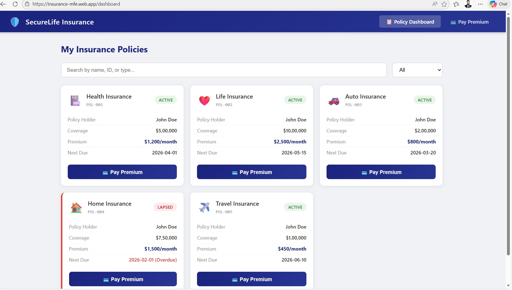
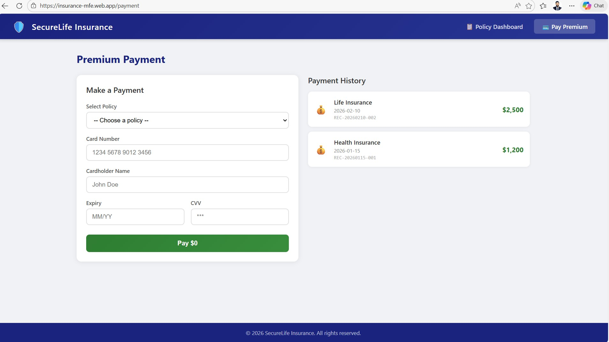
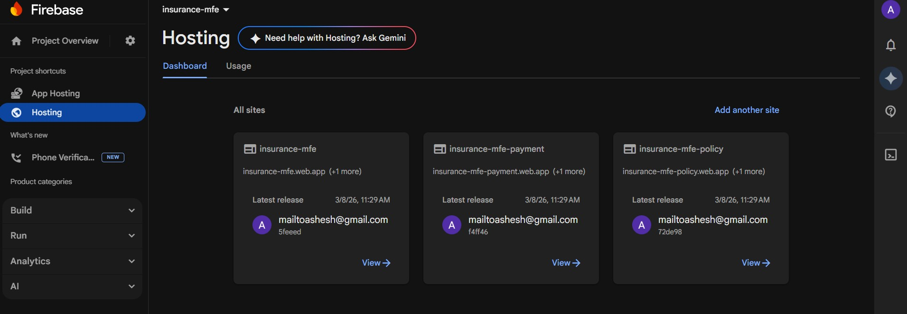

# Insurance MFE — Micro-Frontend Application

A production-ready **Micro-Frontend (MFE)** insurance application built with React 18, Webpack 5 Module Federation, SCSS, Web Workers, and cross-MFE communication. The application is live on **Firebase Hosting** (free tier).

---

## Live Application

| Application       | URL                                        | Description                    |
|-------------------|--------------------------------------------|--------------------------------|
| Container Shell   | https://insurance-mfe.web.app              | Main shell — hosts both MFEs   |
| Policy Dashboard  | https://insurance-mfe-policy.web.app       | Standalone MFE1 (dev/debug)    |
| Premium Payment   | https://insurance-mfe-payment.web.app      | Standalone MFE2 (dev/debug)    |

> The **Container Shell** is the entry point for end users. The individual MFE URLs expose the `remoteEntry.js` endpoints consumed by the container at runtime.

---

## Application Overview

The Insurance MFE demonstrates enterprise-scale micro-frontend architecture applied to an insurance domain:

- **Policy Dashboard (MFE1)** — Browse, search, and filter insurance policies stored in `localStorage`. Select a policy to initiate a premium payment.
- **Premium Payment (MFE2)** — Pre-filled payment form (auto-populated via cross-MFE events), Web Worker-powered receipt generation with 18 % tax calculation, and full payment history.
- **Container (Shell)** — The host application that composes both MFEs via Webpack Module Federation. Provides navigation, global layout, and initial data seeding.

---

## Key Features

| Feature | Details |
|---------|---------|
| Micro-Frontend Architecture | Webpack 5 Module Federation — runtime composition |
| Cross-MFE Communication | Custom DOM Events: `POLICY_SELECTED`, `PAYMENT_COMPLETED` |
| Web Worker | Off-main-thread receipt generation in MFE2 (Blob URL pattern) |
| CSS Pre-processor | SCSS with BEM naming per MFE (`policy-*`, `payment-*`, `shell-*`) |
| Client Storage | `localStorage` — policies (`insurance_policies`) and payments (`insurance_payments`) |
| Data Seeding | Container auto-seeds 5 default policies and 2 payments on first load |
| React Router v6 | Route-based navigation in container (`/dashboard`, `/payment`) |
| Production Build | Webpack production mode with content-hashed assets |
| Firebase Hosting | Multi-site deployment — 3 Firebase sites under one project |
| Express Server | Production static server with CORS headers (self-hosted / Heroku scenarios) |

---

## Architecture Overview

```
┌─────────────────────────────────────────────────────────┐
│                Container Shell  :3000                   │
│                                                         │
│    ┌──────────────────┐    ┌──────────────────────┐    │
│    │   /dashboard     │    │      /payment        │    │
│    │  PolicyDashboard │───▶│  PremiumPayment      │    │
│    │   (MFE1)         │    │   (MFE2)             │    │
│    └──────────────────┘    └──────────────────────┘    │
│          │  POLICY_SELECTED (CustomEvent)    ▲          │
│          └─────────────────────────────────►┘          │
│          ◄──────── PAYMENT_COMPLETED ─────────          │
└─────────────────────────────────────────────────────────┘
         ↓ Module Federation           ↓ Module Federation
┌──────────────────────┐     ┌──────────────────────────┐
│  MFE1 :3001          │     │  MFE2 :3002              │
│  Policy Dashboard    │     │  Premium Payment         │
│  remoteEntry.js      │     │  remoteEntry.js          │
└──────────────────────┘     └──────────────────────────┘
```

---

## Project Structure

```
insurance-mfe/
├── container/                          # Host shell application (port 3000)
│   ├── public/index.html
│   ├── src/
│   │   ├── index.js                    # Entry point
│   │   ├── bootstrap.jsx               # App mount + localStorage seeding
│   │   ├── App.jsx                     # BrowserRouter, lazy MFE imports, routes
│   │   ├── components/
│   │   │   ├── Header.jsx              # Top navigation (NavLink)
│   │   │   └── Header.scss             # SCSS BEM header styles
│   │   ├── data/
│   │   │   └── seed.js                 # Seeds 5 policies + 2 payments into localStorage
│   │   └── styles/
│   │       └── global.scss             # Global reset + shell layout
│   ├── webpack.config.js               # Module Federation host; dev/prod URL switching
│   ├── server.js                       # Express static server (production)
│   └── package.json
│
├── mfe-policy-dashboard/               # MFE1 — Policy Dashboard (port 3001)
│   ├── public/index.html
│   ├── src/
│   │   ├── bootstrap.jsx
│   │   ├── App.jsx                     # PolicyDashboard root
│   │   ├── components/
│   │   │   ├── PolicyList.jsx          # Grid, search, filter, CustomEvent emission
│   │   │   └── PolicyCard.jsx          # Individual policy card component
│   │   └── styles/
│   │       └── PolicyDashboard.scss    # SCSS BEM (`policy-*`)
│   ├── webpack.config.js               # Module Federation remote — exposes PolicyDashboard
│   ├── server.js                       # Express + CORS headers (production)
│   └── package.json
│
├── mfe-premium-payment/                # MFE2 — Premium Payment (port 3002)
│   ├── public/index.html
│   ├── src/
│   │   ├── bootstrap.jsx
│   │   ├── App.jsx                     # PremiumPayment root
│   │   ├── components/
│   │   │   ├── PaymentForm.jsx         # Web Worker, POLICY_SELECTED listener, form submit
│   │   │   └── PaymentHistory.jsx      # localStorage payment history table
│   │   ├── styles/
│   │   │   └── PremiumPayment.scss     # SCSS BEM (`payment-*`)
│   │   └── workers/
│   │       └── receiptWorker.js        # Receipt Worker logic (reference)
│   ├── webpack.config.js               # Module Federation remote — exposes PremiumPayment
│   ├── server.js                       # Express + CORS headers (production)
│   └── package.json
│
├── deploy-firebase.ps1                 # Windows one-shot build + Firebase deploy script
├── deploy-firebase.sh                  # macOS/Linux one-shot build + Firebase deploy script
├── firebase.json                       # Firebase multi-site hosting configuration
├── .firebaserc                         # Firebase project and target bindings
├── ARCHITECTURE.md                     # Full High-Level Design document
├── DEPLOYMENT.md                       # Local dev + Firebase deployment guide
└── README.md                           # This file
```

---

## Quick Start — Local Development

### Prerequisites

- Node.js 16+ and npm 8+

### 1 — Install dependencies

```bash
cd container && npm install && cd ..
cd mfe-policy-dashboard && npm install && cd ..
cd mfe-premium-payment && npm install && cd ..
```

### 2 — Start all development servers

Open **three separate terminals**:

```bash
# Terminal 1 — MFE1 (start first)
cd mfe-policy-dashboard && npm run dev

# Terminal 2 — MFE2 (start second)
cd mfe-premium-payment && npm run dev

# Terminal 3 — Container shell (start last)
cd container && npm run dev
```

| App              | Local URL                  |
|------------------|----------------------------|
| Container Shell  | http://localhost:3000      |
| Policy Dashboard | http://localhost:3001      |
| Premium Payment  | http://localhost:3002      |

> Always start MFE1 and MFE2 **before** the container. The container fetches each remote's `remoteEntry.js` on startup.

### 3 — Open the application

Navigate to **http://localhost:3000** in your browser.

---

## Quick Start — Firebase Deployment

### Windows (PowerShell)

```powershell
.\deploy-firebase.ps1
```

### macOS / Linux (Bash)

```bash
chmod +x deploy-firebase.sh && ./deploy-firebase.sh
```

Both scripts perform a complete clean build of all three apps and deploy to Firebase Hosting in a single command.

---

## Technology Stack

| Layer | Technology | Version |
|-------|-----------|---------|
| UI Framework | React | 18.2.0 |
| Bundler | Webpack | 5.89.0 |
| MFE Composition | ModuleFederationPlugin | (Webpack built-in) |
| Routing | React Router DOM | 6.20.0 |
| CSS Pre-processor | SCSS / sass | 1.69.x |
| Sass Loader | sass-loader (`api: "modern"`) | 13.x |
| Transpilation | Babel (`@babel/preset-react`) | 7.x |
| Client Storage | localStorage (browser built-in) | — |
| Cross-MFE Events | CustomEvent / window | (browser built-in) |
| Web Worker | Blob URL inline pattern | (browser built-in) |
| Production Server | Express | 4.18.2 |
| Hosting | Firebase Hosting (free tier) | — |
| Deploy CLI | Firebase CLI | 15.9.0 |

---

## Screenshots

| Screen | Preview |
|--------|---------|
| Policy Dashboard |  |
| Pay Premium Flow |  |
| Firebase Hosting  |  |
